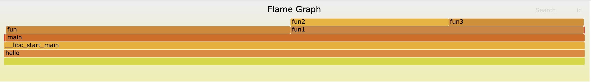

# perf火焰图分析

### 工具介绍：

因为自己是做网络虚拟交换机的，最近碰到一些转发性能上的问题，这时候就需要进行分析了，看下性能瓶颈在哪里，根据木桶短板原理，需要分析其中较为耗时的函数调用，然后对这部分进行优化，从而提升整体程序性能，这个可以通过perf工具来进行数据的采样，然后用github上一个开源的工具生成一个火焰图

1. perf安装：yum install perf
2. 火焰图生成工具：https://github.com/brendangregg/FlameGraph

### 程序代码：

```
#include <stdio.h>
void fun(){
        int i = 0;
        while(i < 2000) {
                i++;
        }
}
void fun2(){
        int i = 0;
        while(i < 1000)i++;
}
void fun3(){
        int i = 0;
        while(i < 1000)i++;
}
void fun1(){
        fun2();
        fun3();
}
int main()
{
        while(1) {
                fun();
                fun1();
        } 
        return 0;
}
```

从上面的程序来看，fun与fun1的执行时间，在整个进程执行过程中所消耗的cpu资源应该各占一半，然后fun2与fun3在整个fun1的执行时间中也是各占一半，下面通过生成火焰图来验证这个想法

### 相关操作：

1. 查找需要进行性能分析的进程pid

    ```
    [root@VM-33-52-centos /data/demo]# ps -ef | egrep [.]/hello
    root     14717 11885 99 21:24 pts/1    00:02:06 ./hello
    ```

      这里得到的进程pid为14717，这里egrep有个"[.]"，可以想下为什么这么写，哈哈。

2. 进行perf数据采样并记录

    ```
    perf record -g -a -F99 -p 14717
    -a: 是监控所有cpu，也可以通过-c指定
    -F: 是采样频率
    -g: 生成图数据
    -p: 指定进程id
    ```

    按ctrl+c结束，这里会得到`perf.data`​数据

    ```
    [root@VM-33-52-centos /data/demo]# ll
    total 76
    drwxr-xr-x 7 root root  4096 Mar  4 20:36 FlameGraph
    -rwxr-xr-x 1 root root  8616 Mar  4 20:43 hello
    -rw-r--r-- 1 root root   266 Mar  4 20:43 hello.c
    -rw------- 1 root root 54864 Mar  4 21:37 perf.data
    ```

3. 生成图

    ```
    [root@VM-33-52-centos /data/demo]# perf script > perf.script && FlameGraph/stackcollapse-perf.pl perf.script | FlameGraph/flamegraph.pl > demo.svg
    [root@VM-33-52-centos /data/demo]# ll
    total 208
    drwxr-xr-x 7 root root   4096 Mar  4 20:36 FlameGraph
    -rw-r--r-- 1 root root  14555 Mar  4 21:47 demo.svg
    -rwxr-xr-x 1 root root   8616 Mar  4 20:43 hello
    -rw-r--r-- 1 root root    266 Mar  4 20:43 hello.c
    -rw------- 1 root root  54864 Mar  4 21:37 perf.data
    -rw-r--r-- 1 root root 116812 Mar  4 21:47 perf.script
    [root@VM-33-52-centos /data/demo]# 
    ```

	demo.svg就是我们最终生成的火焰图

### 验证：

​​​​​​

从上面的图来看，基本符合我们的预想

‍
